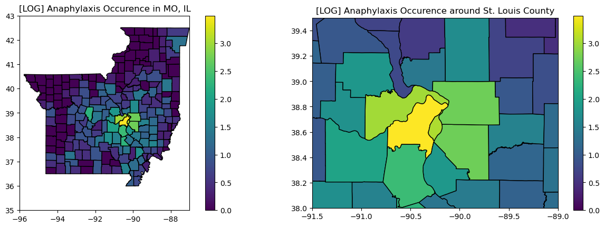

# Geocoding Comparison

Part of my work this summer was to compare the effectiveness of the ArcGIS geocoder, which we have WUSTL institutional access to, and the DEGAUSS geocoder, an open-source tool utilized by OHDSI's Gaia team. 

To do so, I selected the 503 addresses with both address_1 and address_2 (a telltale sign of a complicated address), and 503 randomly sampled addresses with only address_1 (usually a simple address). To each sample, I applied the ArcGIS geocoder (modifying code previously written by Abigail, hence abigailScript.py), and applied the DeGAUSS geocoder (via terminal command). This gave me CSV files, which I compared using geocodeManualAnalysis.py. 

My findings were that for the vast majority of well-formed addresses, ArcGIS and DEGAUSS arrived at the same results. However, for ill-formed addresses (spelling errors, missing parts of addresses, etc.) ArcGIS could geocode some better than DEGAUSS, and vice versa. In general, ArcGIS performed slightly better, enough for us to select it for our study. However, DEGAUSS is still a viable option for a non-institutional researcher looking for a free geocoder.

geocodeManualAnalysis.py includes how I conducted this manual analysis. The code produces the below summary tables using the CSV files (removed from this repository for privacy), and produces additional CSV files with specific address results that I manually compared.

Table:

## Test plots of anaphylaxis cohort

