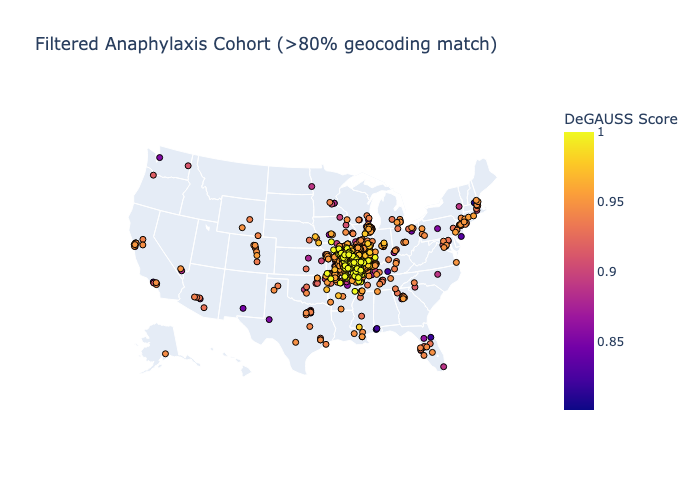
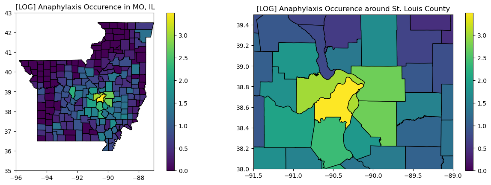
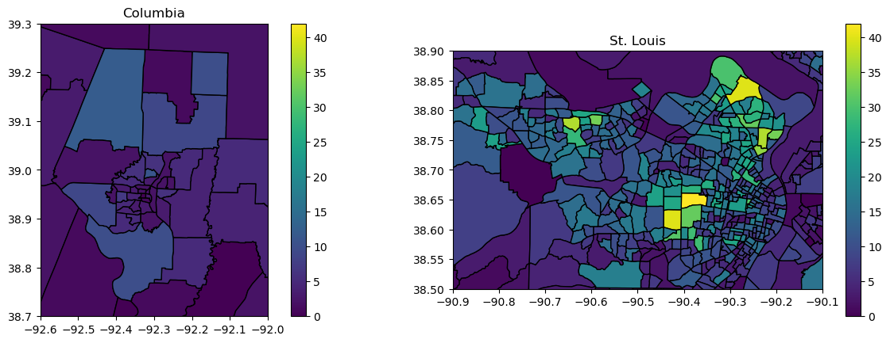

# Geocoding Comparison

Part of my work this summer was to compare the effectiveness of the ArcGIS geocoder, which we have WUSTL institutional access to, and the DEGAUSS geocoder, an open-source tool utilized by OHDSI's Gaia team. 

My findings were that for the vast majority of well-formed addresses, ArcGIS and DEGAUSS arrived at the same results. However, for ill-formed addresses (spelling errors, missing parts of addresses, etc.) ArcGIS could geocode some better than DEGAUSS, and vice versa. In general, ArcGIS performed slightly better, enough for us to select it for our study. However, DEGAUSS is still a viable option for a non-institutional researcher looking for a free geocoder.

Accuracy table:

## Test plots of anaphylaxis cohort

